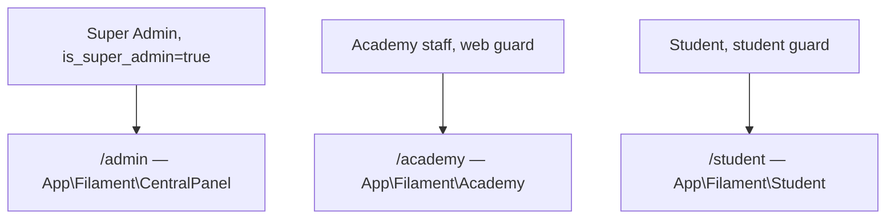

# AGENTS.md — Multi-Tenant SaaS Platform (Laravel + Filament)

Verified against the actual source of `anilvaja/InternationalSportsSolutions`
(not just its README) on 2026-07-31. Where the real implementation differs
from what a generic "multi-tenant Laravel SaaS" template would assume,
this file states the real pattern.

## 1. Tech Stack (from composer.json)

| Layer              | Package                          | Version |
|---------------------|-----------------------------------|---------|
| Framework           | laravel/framework                | ^12.0   |
| PHP                 | —                                  | ^8.2    |
| Admin UI            | filament/filament (+ forms/tables/actions/widgets/infolists) | ^3.3 |
| Media in Filament   | filament/spatie-laravel-media-library-plugin | ^3.3 |
| Multi-tenancy pkg   | stancl/tenancy                    | ^3.9    |
| Roles/permissions   | spatie/laravel-permission         | ^6.21   |
| PDF                 | barryvdh/laravel-dompdf           | ^3.1    |

**Caveat on `stancl/tenancy`**: it's a declared dependency, but tenant
isolation in the actual Filament resources is NOT done via stancl's
per-tenant database switching — it's done manually (see §3). Don't assume
`stancl/tenancy`'s automatic tenant context is what's protecting queries;
verify per-resource before relying on it.

## 2. Panels (real namespaces, not generic placeholders)



- `/admin` → `App\Filament\CentralPanel\Resources\*` — tenant onboarding,
  system settings, global branding.
- `/academy` → `App\Filament\Academy\Resources\*` — the actual product
  (students, batches, fees, attendance, leaves, rooms, pharmacy). Guard:
  `web`. Panel provider: `AcademyPanelProvider::authGuard('web')`.
- `/student` → `App\Filament\Student\Pages\*` — self-service portal.
  Guard: `student` (a distinct Eloquent model `App\Models\Student`, not
  the `User` model). Panel provider: `StudentPanelProvider::authGuard('student')`.

There is no separate guard per role inside `/academy` (admin, coach,
staff, etc. all authenticate via the single `web` guard) — role
distinction happens through permissions, not guards.

## 3. Tenant Isolation — the real mechanism

Tenant model: `App\Models\Academy`. FK column: `academy_id` on every
tenant-scoped table.

Each tenant-scoped model defines a **local query scope**:
```php
// e.g. app/Models/Student.php, Branch.php, etc.
public function scopeForAcademy($query, $academyId)
{
    return $query->where('academy_id', $academyId);
}
```

Every Filament Resource under `App\Filament\Academy\Resources` **must**
override `getEloquentQuery()` to apply it:
```php
public static function getEloquentQuery(): Builder
{
    return parent::getEloquentQuery()->forAcademy(Auth::user()->academy_id);
}
```

This is **not automatic**. There is no global scope. A new resource that
forgets this override will leak cross-tenant data. This is the single
most important thing to check when reviewing agent-generated code for
this app.

`App\Models\User::canAccessAcademy(Academy $academy)` is the
authoritative tenant-access check:
```php
return $this->is_super_admin || $this->academy_id === $academy->id;
```

Test coverage: `tests/Feature/TenantIsolationTest.php` — asserts a
non-super-admin user can access only their own academy, and a super
admin can access any academy. Any new tenant-scoped feature should add
an equivalent assertion.

## 4. Authorization — no Laravel Policies

There is **no `app/Policies` directory**. Do not generate
`php artisan make:policy` boilerplate or reference `authorize()` calls
expecting a policy class — that convention isn't used here.

Instead, every Filament Resource implements its own static methods
backed by `App\Support\AcademyPermissionHelper`:
```php
public static function canViewAny(): bool
{
    return \App\Support\AcademyPermissionHelper::can('view_students');
}
public static function canCreate(): bool
{
    return \App\Support\AcademyPermissionHelper::can('create_students');
}
// ...canEdit(), canDelete() follow the same pattern
```

`AcademyPermissionHelper` resolves permissions by combining the current
user's `AcademyRole` and any per-user overrides in `user_academy_roles`,
scoped to `Auth::user()->academy_id`. When adding a new resource, add its
permission keys (e.g. `view_x`, `create_x`, `edit_x`, `delete_x`) to
wherever the role/permission seed data is defined, and gate all four
`can*()` methods through the helper — don't hand-roll a new auth check.

## 5. Commands

```bash
composer install
cp .env.example .env && php artisan key:generate
php -r "file_exists('database/database.sqlite') || touch('database/database.sqlite');"
php artisan migrate:fresh --seed
php artisan serve

php artisan test                               # full suite
php artisan test --filter=TenantIsolationTest
php artisan test --filter=UiPanelTestingTest
php artisan test --filter=FeeManagementTest

php scripts/ui_test_runner.php                 # custom CLI panel/DOM diagnostic
```

## 6. Agent Workflow Rules

1. Read before writing: check `app/Models`, the relevant
   `app/Filament/Academy/Resources/*Resource.php` (or `CentralPanel`/
   `Student` equivalents), and existing tests in the same area first.
2. New tenant-scoped model → add `scopeForAcademy()` following the
   existing pattern, and use it in the Resource's `getEloquentQuery()`.
   Never skip this.
3. New Filament Resource → implement `canViewAny/canCreate/canEdit/
   canDelete` via `AcademyPermissionHelper::can(...)`, not a Policy.
4. New feature affecting `/academy` data → add or extend a
   `TenantIsolationTest`-style assertion.
5. UI-facing change → run `php artisan test --filter=UiPanelTestingTest`
   and `php scripts/ui_test_runner.php` before calling it done.
6. Don't touch `Academy` subscription-limit fields (`max_branches`,
   `max_students`, `max_coaches`) without an explicit task for it.
7. Use `.agents/skills/application-agent/SKILL.md` for feature work and
   `.agents/skills/ui-testing-agent/SKILL.md` for UI regression checks.

## 7. Directory Structure (verified)

```
InternationalSportsSolutions/
├── .agents/
│   ├── AGENTS.md
│   └── skills/
│       ├── application-agent/SKILL.md   # name: application-development-agent
│       └── ui-testing-agent/SKILL.md
├── app/
│   ├── Filament/
│   │   ├── CentralPanel/Resources/       # /admin
│   │   ├── Academy/Resources/            # /academy
│   │   ├── Student/Pages/                # /student
│   │   └── Resources/                    # shared/legacy resources
│   ├── Models/                           # Academy, Student, Coach, Batch, Fee...
│   ├── Support/AcademyPermissionHelper.php
│   └── Providers/Filament/               # one provider per panel
├── database/{migrations,seeders}/
├── scripts/ui_test_runner.php
└── tests/Feature/
    ├── TenantIsolationTest.php
    ├── UiPanelTestingTest.php
    └── FeeManagementTest.php
```
