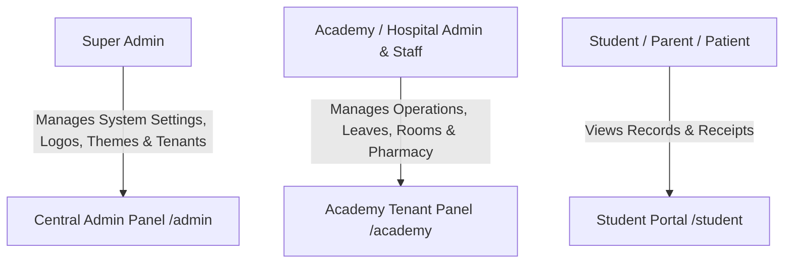

# International Sports & Hospital Solutions — Multi-Tenant SaaS Platform

[](https://laravel.com)
[](https://filamentphp.com)
[](https://php.net)
[](LICENSE)

**International Sports & Hospital Solutions** is an enterprise-grade, multi-tenant SaaS platform built with **Laravel 12** and **Filament PHP 3**. It provides a multi-panel SaaS system designed to streamline operations, student & patient management, coach & doctor schedules, leave tracking, room & facility allocations, pharmacy stock imports, fee installment management, event registrations, and dynamic theme customization.

---

## 🌟 Recent System Improvements & Feature Upgrades

### 🎨 1. Dynamic Branding, Logo & Theme Colors System
- **Super Admin System Settings (`/admin/system-settings`)**:
  - Super Admins can dynamically change the **Hospital / System Name**, upload a custom **System Logo**, and configure the **Primary & Secondary Theme Accent Colors** via an interactive Color Picker.
- **Cross-Panel Dynamic Theme Synchronization**:
  - Automatically propagates dynamic branding, custom logos, and primary theme colors across all three panels (`/admin`, `/academy`, `/student`) and the public welcome landing page (`/`).

### 🍃 2. Leaves Management Module
- **Comprehensive Leave Request Tracking**:
  - Track leave applications for staff, coaches, and students/patients.
  - Supports multiple leave types (Sick Leave, Casual Leave, Medical Leave, Unpaid Leave).
- **Approval & Workflow Status**:
  - Role-based approval/rejection workflows (`Pending`, `Approved`, `Rejected`).
  - Automated leave balance calculations and conflict checking for batch/class assignments.

### 🏢 3. Rooms & Facilities Management Module
- **Facility & Room Allocations**:
  - Manage rooms, training halls, courts, wards, and facility capacities.
  - Track room status (`Available`, `Occupied`, `Under Maintenance`, `Reserved`).
- **Batch & Event Scheduling Assignments**:
  - Assign specific rooms or facilities to batches, training sessions, or events to eliminate scheduling double-bookings.

### 💊 4. Pharmacy & Supplies Import Options
- **Bulk Pharmacy Data Ingestion**:
  - Import medicine stock, pharmaceutical supplies, and inventory data via CSV, Excel, or JSON import options.
- **Validation & Inventory Tracking**:
  - Automated column mapping, data validation checks (batch numbers, expiry dates, stock quantities, unit prices), and inventory adjustment logs.

### 🧪 5. Automated UI Testing and Application Agent Workflow
- **Application Development Agent Skill (`application-development-agent`)**:
  - Use this agent for feature implementation, incremental updates, and repository-guided development tasks.
  - The agent reviews current models, Filament resources, routes, and tests before generating code.
- **UI Testing Agent Skill (`ui-testing-agent`)**:
  - Built-in agent skill and workspace instructions (`.agents/AGENTS.md`) for automated UI regression checks.
- **CLI Visual UI Impact Diagnostic Runner**:
  - Run `php scripts/ui_test_runner.php` to inspect rendered HTML DOM structure, count UI components (buttons, inputs, forms, cards), and detect missing elements or layout regressions.
- **Feature UI Assertion Suite**:
  - Execute `php artisan test --filter=UiPanelTestingTest` to verify 100% clean rendering across all panels.

---

## 🏛️ System Architecture & Multi-Panels

The application is structured into **3 specialized panels**:



### 1. Central Admin Panel (`/admin`)
- **System & UI Settings**: Dynamic Hospital/System Name, Logo Upload, Primary Theme Color Picker (`Color::hex`), and Support Contacts.
- **Tenant & Academy Management**: Create, onboard, activate, and configure tenant academies/facilities.
- **Subscription Limits Control**: Set maximum branches, users, coaches, and student capacity limits per tenant.
- **Global User Management**: Manage platform super admins and tenant administrators.
- **System Audit Logs**: Global audit trail tracking operational changes.

### 2. Academy Tenant Panel (`/academy`)
- **Leaves Management**: Staff, coach, and student leave requests, leave approvals, and balance logs.
- **Rooms & Facilities**: Manage room capacities, status allocations, and batch scheduling assignments.
- **Pharmacy & Stock Imports**: CSV/Excel bulk import options for pharmacy inventory, medicine batches, and stock management.
- **Branch Management**: Multi-branch support per tenant with location, contact, and manager details.
- **Student Management**: Profiles, emergency contacts, medical history, guardian details, and document uploads.
- **Coach & Staff Management**: Professional profiles, certifications, hourly/monthly pay rates, and batch availability.
- **Batches & Scheduling**: Flexible recurring schedule management with room allocation and coach assignments.
- **Attendance Tracking**: Real-time batch-wise attendance marking, present/absent history, and exports.
- **Fee Management**: Installment payments, monthly fee rates, receipt generation, advance payments, discounts, and overdue tracking.
- **Granular Roles & Permissions**: Tenant-level custom roles, per-user extra permissions, and resource authorization.

### 3. Student Portal (`/student`)
- **Personal Dashboard**: Overview of enrolled batches, next due date, and attendance summaries.
- **Fee History**: View past payment receipts, breakdown of fees, and upcoming installment dates.
- **Attendance Record**: Track class presence and make-up session records.
- **Syllabus & Event Progress**: View completed techniques, belt progression milestones, and upcoming events.

---

## 🛠️ Technology Stack

| Layer | Technology / Package | Purpose |
|---|---|---|
| **Framework** | Laravel `12.x` | Core application framework |
| **PHP Version** | `PHP 8.2+` | Runtime environment |
| **Admin UI & Forms** | Filament PHP `v3.3` | Panel builder, Livewire 3, Tailwind CSS, Alpine.js |
| **Multi-Tenancy** | `stancl/tenancy` | Tenant data isolation & tenant management |
| **Permissions & Roles** | `spatie/laravel-permission` + Custom `user_academy_roles` | Granular role-based authorization |
| **PDF Generation** | `barryvdh/laravel-dompdf` | Fee receipts and attendance reports |
| **Media Management** | `spatie/laravel-medialibrary` | Student documents, logos, certificates |
| **Database** | SQLite (Default for Dev) / MySQL / PostgreSQL | Relational database storage |
| **Testing** | PHPUnit / Pest PHP | Feature, unit, and UI impact testing |

---

## 🗄️ Database Schema & Models Overview

The core domain model comprises primary Eloquent models including:

- **Setting**: Key-value system settings table handling dynamic system name, logo, primary theme color, and support details.
- **Academy**: Core tenant model containing status, domain, subscription limits (`max_branches`, `max_students`, `max_coaches`), and metadata.
- **Branch**: Physical tenant branches/locations.
- **User**: Multi-tenant user model handling super admin, academy admin, coach, and staff access.
- **Student**: Comprehensive student/patient profile linked to tenant and branch.
- **Coach**: Professional coach/staff profile with specializations, certifications, and salary structure.
- **Batch**: Class batches with room allocations, schedule definitions, coach assignments, and student enrollments.
- **Attendance / BatchAttendance**: Batch attendance logs and individual presence status.
- **StudentFee / Fee / FeeStructure**: Fee collection records, auto-generated receipt numbers, installment details, and fee structure templates.
- **AcademyRole / UserAcademyRole / AcademyPermission**: Tenant-level custom roles and user permission assignments.
- **Audit / OverdueFeeNotification**: Audit trails and overdue notices.

---

## 🚀 Installation & Local Setup

### Prerequisites
- **PHP** >= 8.2 (with `pdo_sqlite` or `pdo_mysql`, `mbstring`, `fileinfo`, `gd` extensions enabled)
- **Composer** >= 2.0
- **Node.js** >= 18.x & NPM

### Step-by-Step Setup

1. **Clone the Repository**
   ```bash
   git clone https://github.com/your-org/InternationalSportsSolutions.git
   cd InternationalSportsSolutions
   ```

2. **Install PHP Dependencies**
   ```bash
   composer install
   ```

3. **Configure Environment File**
   ```bash
   cp .env.example .env
   php artisan key:generate
   ```

4. **Initialize Database**
   Ensure SQLite file exists or configure MySQL credentials in `.env`:
   ```bash
   # For SQLite (default)
   php -r "file_exists('database/database.sqlite') || touch('database/database.sqlite');"
   ```

5. **Run Migrations & Seed Sample Data**
   ```bash
   php artisan migrate:fresh --seed
   ```

6. **Serve the Application**
   ```bash
   php artisan serve
   ```
   The application will be accessible at `http://127.0.0.1:8000`.

---

## 🔑 Accessing Panels & Default Credentials

When running `php artisan db:seed`, sample academies, users, students, and settings are automatically populated:

| Panel | URL Path | Role | Sample Credentials |
|---|---|---|---|
| **Central Admin** | `/admin` | Super Admin | **Email:** `anilvaja.007@gmail.com`<br>**Password:** `password` |
| **System Settings** | `/admin/system-settings` | Super Admin | Access from System Settings menu item in Admin Panel |
| **Academy Panel** | `/academy` | Academy Owner / Admin | **Email:** `admin@mahavirsports.com`<br>**Password:** `password123` |
| **Academy Panel** | `/academy` | Staff User | **Email:** `john.smith@mahavirsportsacademy.com`<br>**Password:** `password123` |
| **Student Portal** | `/student` | Student | Log in using registered student email / password |

---

## 🧪 Running Automated UI & Unit Tests

### 1. CLI Visual UI Diagnostic Test Runner
Inspect rendered HTML DOM elements, button/input counts, and layout health:
```bash
php scripts/ui_test_runner.php
```

### 2. Feature & Unit Test Suite
Execute the full Laravel test suite:
```bash
php artisan test
```

### Example Test Suite Output:
```text
   PASS  Tests\Unit\ExampleTest
  ✓ that true is true

   PASS  Tests\Feature\ExampleTest
  ✓ the application returns a successful response

   PASS  Tests\Feature\FeeManagementTest
  ✓ student fee record creation and status

   PASS  Tests\Feature\TenantIsolationTest
  ✓ user can only access own academy data
  ✓ super admin can access any academy

   PASS  Tests\Feature\UiPanelTestingTest
  ✓ welcome page renders successfully
  ✓ admin panel login page renders
  ✓ super admin can access admin dashboard
  ✓ academy panel login page renders
  ✓ academy user can access academy dashboard
  ✓ student portal login page renders

  Tests:    11 passed (16 assertions)
  Duration: 7.40s
```

---

## 📄 Directory Structure

```text
InternationalSportsSolutions/
├── .agents/
│   ├── AGENTS.md             # Workspace rules & UI testing guidelines
│   └── skills/
│       └── ui-testing-agent/ # UI Testing Agent skill instructions
├── app/
│   ├── Filament/
│   │   ├── Academy/          # Tenant Academy Panel Resources & Pages (/academy)
│   │   ├── CentralPanel/     # Super Admin Central Panel Resources (/admin)
│   │   ├── Pages/            # SystemSettings.php for dynamic Super Admin config
│   │   └── Student/          # Student Portal Pages & Components (/student)
│   ├── Models/               # Eloquent Models (Setting, Academy, Student, Coach, Batch...)
│   └── Providers/            # Panel Providers (AdminPanelProvider, AcademyPanelProvider...)
├── database/
│   ├── migrations/           # Database Migration files
│   └── seeders/              # Comprehensive Seeders (Academies, Roles, Settings)
├── resources/
│   └── views/
│       ├── components/       # dynamic-brand-logo.blade.php component
│       ├── filament/         # Filament custom page views
│       └── welcome.blade.php # Landing page with dynamic branding & colors
├── scripts/
│   └── ui_test_runner.php    # CLI visual UI impact diagnostic tool
└── tests/
    └── Feature/              # Feature & UI Test Suites (UiPanelTestingTest.php)
```

---

## 📝 License

This software is proprietary and developed for **International Sports & Hospital Solutions**. All rights reserved.
